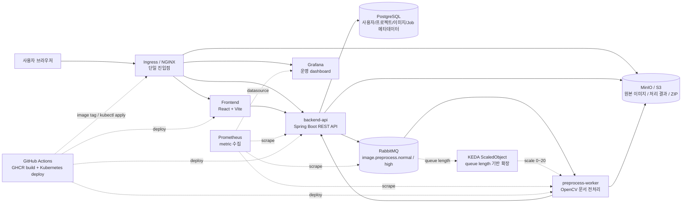
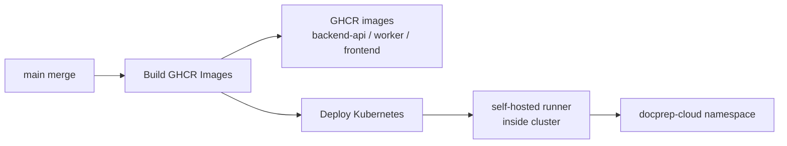

# DocPrep Cloud

대량 스캔 문서 이미지를 OCR 전에 전처리하는 큐 기반 SaaS 플랫폼입니다.

DocPrep Cloud는 사용자가 여러 문서 이미지나 ZIP 파일을 업로드하면, Spring Boot API가 작업을 등록하고 RabbitMQ queue를 통해 Worker가 이미지 단위로 병렬 전처리를 수행하는 시스템입니다. 단순 이미지 리사이징이 아니라 OCR 입력 품질을 높이기 위한 문서 이미지 전처리 파이프라인에 초점을 둡니다.

## 무엇을 해결하는가

스캔 문서 이미지는 원본마다 방향, 기울기, 여백, 노이즈, 대비, DPI가 다릅니다. 이 상태로 OCR을 수행하면 인식률이 떨어지고, 대량 문서 처리에서는 수작업 보정 비용이 커집니다.

이 프로젝트는 아래 문제를 해결합니다.

| 문제 | 해결 방식 |
| --- | --- |
| 대량 이미지 업로드가 API 서버에 부담을 줌 | presigned URL로 브라우저가 Object Storage에 직접 업로드 |
| CPU 중심 이미지 처리가 웹 요청을 막음 | API 서버와 Worker를 분리하고 RabbitMQ로 비동기 처리 |
| OCR 전처리 품질이 입력마다 흔들림 | OpenCV 기반 단계별 전처리 파이프라인 적용 |
| 작업량이 순간적으로 몰림 | KEDA가 RabbitMQ queue length 기준으로 Worker 자동 확장 |
| 운영 상태를 확인하기 어려움 | Prometheus, Grafana, kube-state-metrics로 queue와 Worker 상태 관측 |

## 현재 지원 기능

| 영역 | 기능 |
| --- | --- |
| 인증 | Google OAuth 로그인, JWT Access Token, Refresh Token 회전, HttpOnly refresh cookie |
| 프로젝트 | 프로젝트 생성, 목록 조회, 상세 조회, 사용자별 프로젝트 관리 |
| 업로드 | 다중 이미지 업로드, ZIP 업로드, SHA-256 checksum, presigned URL 업로드 |
| 이미지 | 원본 이미지 메타데이터 저장, 형식 검증, 처리 결과 다운로드 |
| Job | 이미지 단위 `JobItem` 생성, RabbitMQ 발행, 상태 조회, 실패 상태 저장 |
| Worker | OpenCV 기반 문서 이미지 전처리, 결과 이미지 저장, backend-api callback |
| 결과 | 처리된 이미지 단건 다운로드, Job 결과 ZIP 다운로드 |
| 프론트엔드 | 프로젝트, 업로드, Job 상세, 이미지 상세, 대시보드 MVP 화면 |
| 운영 | Docker Compose local, Kubernetes, KEDA, GHCR, GitHub Actions, Prometheus, Grafana |

현재 범위에서 Kakao 로그인, OCR 인식 엔진 자체, Admin/Audit 도메인은 제외했습니다. 이 프로젝트는 OCR 실행 서비스가 아니라 OCR 전처리 플랫폼입니다.

## 아키텍처



## 처리 흐름

### 1. 로그인

```text
사용자
  -> /oauth2/authorization/google
  -> Google OAuth 인증
  -> /login/oauth2/code/google
  -> backend-api가 사용자 확인 또는 생성
  -> Refresh Token을 HttpOnly cookie로 설정
  -> /oauth2/success?login=success
  -> frontend가 /api/v1/auth/refresh로 Access Token 발급
```

Access Token은 URL에 넣지 않습니다. 현재 MVP 프론트엔드는 API 호출을 위해 Access Token을 `localStorage`에 보관하며, Refresh Token은 JavaScript가 읽을 수 없는 HttpOnly cookie로 관리합니다. 운영 보안 강화 단계에서는 Access Token 저장 방식을 memory-only로 전환하는 것이 권장됩니다.

### 2. 업로드

```text
Frontend
  -> upload session 생성
  -> 파일별 checksum 계산
  -> presigned URL 발급 요청
  -> MinIO/S3에 원본 직접 PUT
  -> upload complete 요청
  -> backend-api가 이미지 메타데이터 생성
```

대용량 이미지 파일을 backend-api가 직접 받지 않도록 설계했습니다.

### 3. 전처리 Job

```text
Frontend
  -> Job 생성 요청

backend-api
  -> Job 생성
  -> 이미지별 JobItem 생성
  -> RabbitMQ 메시지 발행

preprocess-worker
  -> 메시지 소비
  -> 원본 이미지 다운로드
  -> OpenCV 전처리 파이프라인 실행
  -> 처리 결과 업로드
  -> backend-api internal callback
```

이미지 한 장이 하나의 `JobItem`입니다. 이 구조 때문에 Worker가 여러 개로 늘어나면 같은 Job 안의 이미지를 병렬 처리할 수 있습니다.

## Worker 전처리 파이프라인

Worker는 단순 resize가 아니라 아래 단계를 수행합니다.

| 순서 | 단계 | 목적 |
| ---: | --- | --- |
| 1 | Decode | 입력 파일을 OpenCV 처리 가능한 이미지로 변환 |
| 2 | Color Normalize | Gray/BGR/BGRA 입력을 일관된 색상 공간으로 정규화 |
| 3 | Orientation Normalize | 큰 방향 오류 보정 |
| 4 | Deskew | 문서 기울기 보정 |
| 5 | Crop | 문서 영역 추출과 불필요한 여백 제거 |
| 6 | Denoise | 노이즈 제거 |
| 7 | Contrast Normalize | 저대비 문서 보정 |
| 8 | Binarization | OCR에 유리한 흑백화 |
| 9 | Morphology Cleanup | 작은 노이즈와 획 끊김 보정 |
| 10 | DPI Normalize | OCR 입력 품질 기준에 맞춘 DPI 정규화 |
| 11 | Optional Sharpen | 필요 시 선명화 |

지원 프리셋은 `A4_SCAN_300DPI`, `LOW_CONTRAST_SCAN`, `RECEIPT`, `NOISY_SCAN`입니다.

## Kubernetes 운영 기준

현재 Kubernetes 운영 namespace는 `docprep-cloud`입니다.

| 컴포넌트 | Replica | CPU request | Memory request | CPU limit | Memory limit |
| --- | ---: | ---: | ---: | ---: | ---: |
| backend-api | 2 | 250m | 512Mi | 1 | 1Gi |
| frontend | 2 | 100m | 128Mi | 500m | 256Mi |
| nginx | 2 | 100m | 128Mi | 500m | 256Mi |
| preprocess-worker | 0~20 | 500m | 1Gi | 2 | 2Gi |
| postgres | 1 | 100m | 256Mi | 500m | 512Mi |
| rabbitmq | 1 | 100m | 256Mi | 500m | 512Mi |
| minio | 1 | 100m | 256Mi | 500m | 512Mi |
| prometheus | 1 | 200m | 512Mi | 1 | 1Gi |
| grafana | 1 | 100m | 256Mi | 500m | 512Mi |

Worker는 KEDA가 RabbitMQ queue length를 보고 자동 확장합니다.

| 항목 | 현재 값 |
| --- | --- |
| min replica | 0 |
| max replica | 20 |
| normal queue | `image.preprocess.normal`, threshold 25 |
| high queue | `image.preprocess.high`, threshold 10 |
| cooldown | 300초 |

queue가 비어 있으면 `preprocess-worker`가 `0/0`으로 보이는 것이 정상입니다. 사용자 체감 속도를 우선하면 `minReplicaCount=1`, 유휴 비용 절감을 우선하면 `minReplicaCount=0`을 사용합니다.

최근 500장 실험에서는 아래 결과를 확인했습니다.

| 방식 | 큐 대기 | 처리 시간 | 전체 시간 | 성공/전체 |
| --- | ---: | ---: | ---: | ---: |
| Fixed Worker 1개 | 2.716초 | 98.1초 | 100.815초 | 500/500 |
| HPA CPU | 2.145초 | 91.736초 | 93.881초 | 500/500 |
| KEDA min 1 | 2.209초 | 59.728초 | 61.937초 | 500/500 |
| KEDA min 0 | 29.183초 | 52.572초 | 81.755초 | 500/500 |

해석은 명확합니다. RabbitMQ 기반 batch Worker에는 CPU 사용률만 보는 HPA보다 queue backlog를 직접 보는 KEDA가 더 적합합니다.

## 기술 스택

| 영역 | 기술 |
| --- | --- |
| Backend API | Java, Spring Boot, Spring Security OAuth2, JPA |
| Worker | Java, Spring Boot, OpenCV |
| Frontend | React, Vite, TypeScript |
| Queue | RabbitMQ |
| Database | PostgreSQL |
| Object Storage | MinIO / S3 compatible storage |
| Proxy | NGINX, Kubernetes Ingress |
| Observability | Prometheus, Grafana, OpenTelemetry Collector, kube-state-metrics |
| Autoscaling | KEDA, Kubernetes HPA |
| CI/CD | GitHub Actions, GHCR, Kubernetes self-hosted runner |

## 레포지토리 구조

```text
backend-api/          Spring Boot REST API
preprocess-worker/   RabbitMQ 기반 문서 이미지 전처리 Worker
frontend/            React/Vite 프론트엔드
infra/               Docker Compose, NGINX, Kubernetes, monitoring manifest
docs/                아키텍처, API, 운영, Worker, 기능 명세 문서
scripts/             로컬 검증, Kubernetes 전환, 배치 벤치마크 스크립트
```

## 로컬 실행

### 1. 환경변수 준비

```powershell
Copy-Item infra/docker-compose/.env.example infra/docker-compose/.env
```

Google OAuth를 실제로 테스트하려면 `infra/docker-compose/.env`에 Google Client ID/Secret을 넣고 Google Console에 아래 redirect URI를 등록합니다.

```text
http://localhost/login/oauth2/code/google
```

### 2. Docker Compose 실행

```powershell
docker compose -f infra/docker-compose/docker-compose.local.yml --env-file infra/docker-compose/.env up -d --build
```

### 3. 접속 주소

| 서비스 | 주소 |
| --- | --- |
| Frontend | `http://localhost` |
| Backend API | `http://localhost/api` |
| Swagger UI | `http://localhost/swagger-ui/index.html` |
| MinIO Console | `http://localhost:9001` |
| RabbitMQ Management | `http://localhost:15672` |

### 4. 검증 방법

일반 검증은 브라우저 UI에서 진행합니다.

```text
1. Google 로그인
2. 프로젝트 생성
3. 이미지 또는 ZIP 업로드
4. 전처리 Job 생성
5. 처리된 이미지 또는 Job ZIP 다운로드
```

개발자용 스모크 스크립트는 Access Token이 필요합니다. 브라우저에서 로그인한 뒤 개발자 도구 Console에서 아래처럼 임시 토큰을 확인할 수 있습니다.

```javascript
localStorage.getItem('doc-pipeline.access-token')
```

```powershell
.\scripts\local-e2e-smoke.ps1 -BaseUrl "http://localhost/api" -AccessToken "<access-token>"
```

## Kubernetes 배포

현재 배포 흐름은 GitHub Actions 자동 배포가 기준입니다.



자동 배포 흐름:

1. PR을 `main`에 merge합니다.
2. `Build GHCR Images` workflow가 세 서비스 이미지를 GHCR에 push합니다.
3. 이미지 빌드가 성공하면 `Deploy Kubernetes` workflow가 자동 실행됩니다.
4. Kubernetes 내부 self-hosted runner가 manifest에 이미지 태그와 도메인을 주입합니다.
5. `kubectl apply` 후 `backend-api`, `frontend`, `nginx` rollout을 확인합니다.

자세한 절차는 [Kubernetes GitHub Actions 배포](docs/operation/kubernetes-github-actions-deploy.md)를 확인합니다.

## 운영 전 확인해야 할 한계

| 항목 | 현재 상태 | 운영 전 조치 |
| --- | --- | --- |
| PostgreSQL 저장소 | `emptyDir` | PVC 또는 managed DB로 전환 |
| RabbitMQ 저장소 | `emptyDir` | PVC 또는 managed queue로 전환 |
| MinIO 저장소 | `emptyDir` | PVC, MinIO Operator, 또는 managed S3로 전환 |
| Grafana 계정 | 기본 계정 사용 | Secret 기반 강한 비밀번호로 교체 |
| Access Token 저장 | MVP 프론트는 localStorage 사용 | memory-only 저장 또는 강화된 세션 전략 검토 |
| TLS/도메인 | ngrok 또는 수동 secret | 운영 도메인과 인증서 자동화 |
| Alert | Dashboard 중심 | Prometheus alert rule 추가 |

## 주요 문서

| 문서 | 설명 |
| --- | --- |
| [문서 인덱스](docs/README.md) | 전체 문서 진입점 |
| [시스템 개요](docs/architecture/system-overview.md) | 컴포넌트와 데이터 흐름 |
| [Kubernetes/KEDA 아키텍처](docs/architecture/kubernetes-architecture.md) | Kubernetes 리소스와 Worker autoscaling |
| [런타임 자원 정책](docs/architecture/runtime-resource-policy.md) | 컨테이너 requests/limits, replica, KEDA 기준 |
| [API 문서](docs/api/api-index.md) | 도메인별 API 문서 |
| [Worker 파이프라인](docs/worker/preprocess-pipeline.md) | OpenCV 전처리 단계 |
| [운영 원칙](docs/operation/operating-principles.md) | 배포, secret, 장애 대응, 관측성 기준 |
| [Kubernetes 배포](docs/operation/kubernetes-deployment.md) | Kubernetes 상태 확인과 운영 절차 |
| [KEDA 배치 비교 실험](docs/operation/keda-batch-benchmark.md) | KEDA/HPA/고정 Worker 성능 비교 |

## 개발 원칙

- Spring은 도메인형 패키지 구조를 유지합니다.
- API 서버는 OpenCV 전처리를 직접 수행하지 않습니다.
- Worker는 OAuth, 사용자 인증, 화면용 API를 갖지 않습니다.
- Object Storage 접근은 adapter/port 구조로 분리합니다.
- 실제 secret 값은 Git과 문서에 기록하지 않습니다.
- 기능 변경 PR은 관련 문서와 검증 결과를 함께 포함합니다.
